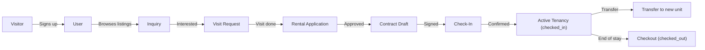

# RentDito — Implementation Plan v3 (Final)

---

## 1. Two-Layer Architecture

### Layer 1: Account (Who you are)

| Role | How you get it | Description |
|---|---|---|
| `user` | Default on signup | Can browse, inquire, visit, apply, become a tenant via Tenancy |
| `landlord` | Promoted by super_admin | Manages properties, units, staff, tenants |
| `staff` | Created by landlord | Scoped access to assigned properties + toggled feature modules |
| `super_admin` | Seeded / manually set | Platform-wide management |

### Layer 2: Tenancy (What you're doing)

A **Tenancy** is an operational record linking a `user` to a `unit`. It is NOT a role.

```
User (role: user) + Tenancy (status: checked_in) = Operational Tenant
```

| Tenancy Status | Meaning |
|---|---|
| `pending` | Approved application, awaiting check-in confirmation |
| `checked_in` | Active tenant — billing, inventory, maintenance all live |
| `checked_out` | Former tenant — record preserved for history/reporting |

> [!IMPORTANT]
> A user's account role stays `user` even when they have an active tenancy. The tenant dashboard sections appear dynamically when `user.activeTenancy` exists with `checked_in` status. There is no `tenant` role.

---

## 2. Tenancy Pipeline (User → Tenant Lifecycle)



Each stage has its own model, API, and UI. A user can be at multiple stages simultaneously (e.g., checked-in at one property while inquiring about another).

---

## 3. Complete Model Map

```
┌─────────────────────────────────────────────────┐
│  ACCOUNT LAYER                                   │
│                                                   │
│  User ──────────┬── LandlordApplication           │
│  (role, verify) │                                 │
│                 ├── Staff config                   │
│                 │   (permissions, positionName,    │
│                 │    assignedPropertyIds)           │
│                 │                                  │
├─────────────────┼──────────────────────────────────┤
│  PROPERTY LAYER │                                  │
│                 │                                  │
│  Property ──────┼── Unit ── Slot (bedspace)        │
│  (landlordId)   │   (propertyId)                  │
│                 │                                  │
├─────────────────┼──────────────────────────────────┤
│  PIPELINE LAYER │                                  │
│                 │                                  │
│  Inquiry ───────┼── Conversation ── Message        │
│  VisitRequest   │                                  │
│  RentalApplication                                 │
│  Contract ──────┼── Signature                      │
│                 │                                  │
├─────────────────┼──────────────────────────────────┤
│  TENANCY LAYER  │                                  │
│                 │                                  │
│  Tenancy ───────┼── Bill ── Payment               │
│  (userId,       │── InventoryRecord               │
│   unitId,       │── Ticket (maintenance)           │
│   contractId,   │── TransferRequest               │
│   status)       │                                  │
│                 │                                  │
├─────────────────┼──────────────────────────────────┤
│  SUPPORT LAYER  │                                  │
│                 │                                  │
│  Notification   │   Document                       │
│  AuditLog       │   IncidentReport                │
│  Inventory      │   (property-level item catalog)  │
└─────────────────┴──────────────────────────────────┘
```

### Key Model Schemas

#### User
```
name, email, phone, passwordHash,
role: 'user' | 'landlord' | 'staff' | 'super_admin',
status: 'active' | 'suspended',
verificationStatus: 'unverified' | 'pending' | 'verified',
idPhotos: string[],                         // uploaded ID images
avatar?: string,
// Staff-specific:
landlordId?: ObjectId,
assignedPropertyIds?: ObjectId[],
permissions?: string[],
positionName?: string,
// Populated virtually:
activeTenancy?: Tenancy                     // looked up, not stored
```

#### Tenancy
```
userId → User,
propertyId → Property,
unitId → Unit,
contractId → Contract,
status: 'pending' | 'checked_in' | 'checked_out',
checkInDate?, checkOutDate?,
// Occupancy:
slotNumber?: number,                        // bedspace mode
isPrimary?: boolean,                        // whole-unit mode
householdMembers?: [{name, relation}],
// Meta:
personalDetails: {fullName, phone, emergencyContact, idDetails, address, occupation},
createdAt, updatedAt
```

#### Inquiry
```
userId → User, propertyId → Property, unitId? → Unit,
subject, status: 'open' | 'in_progress' | 'closed' | 'converted',
createdAt
```

#### Conversation + Message
```
Conversation: inquiryId → Inquiry, participants: [ObjectId]
Message: conversationId, senderId, content, attachments[], readBy[], createdAt
```

#### VisitRequest
```
userId → User, propertyId → Property, unitId? → Unit,
requestedDate, requestedTime, scheduledDate?, scheduledTime?,
purpose: 'viewing' | 'inspection',
status: 'pending' | 'approved' | 'scheduled' | 'completed' | 'cancelled' | 'no_show',
assignedStaffId? → User, notes?, createdAt
```

#### RentalApplication
```
userId → User, propertyId → Property, unitId → Unit,
personalDetails: {fullName, phone, occupation, school?, address, emergencyContact},
documents: string[],
status: 'pending' | 'under_review' | 'approved' | 'rejected',
reviewedBy? → User, reviewNotes?, reviewedAt?,
createdAt
```

#### Contract
```
applicationId → RentalApplication,
tenancyId? → Tenancy,
propertyId, unitId, landlordId, userId,
startDate, endDate, lockInPeriod (months), monthlyRent,
securityDeposit, advancePayment,
utilityIncludedInRent: boolean, rateType: 'fixed' | 'submetered',
terms?: string,
landlordSignature?: string (base64), userSignature?: string,
signedAt?,
status: 'draft' | 'pending_review' | 'pending_signature' | 'signed' | 'active' | 'expired' | 'terminated',
documentUrl?, createdAt, updatedAt
```

#### Bill
```
tenancyId → Tenancy, propertyId, unitId, contractId?,
type: 'rent' | 'utility' | 'penalty' | 'combined',
billingPeriod: {start, end},
rentAmount, utilityAmount, penaltyAmount, totalAmount, paidAmount, balanceAmount,
status: 'unpaid' | 'partial' | 'paid' | 'overdue',
dueDate,
utilityBreakdown?: {electricity, water, internet, others},
isAutoGenerated, notes?, createdAt
```

#### Payment
```
billId → Bill, tenancyId, amount, paymentDate,
method: 'cash' | 'gcash' | 'bank_transfer' | 'other',
referenceNumber?, proofImageUrl?,
recordedByUserId → User, notes?, createdAt
```

#### Inventory (property-level catalog)
```
propertyId → Property,
itemName, serialNumber, condition, quantity, status,
purchaseDate?, purchaseCost?, createdAt
```

#### InventoryRecord (per-tenancy issuance)
```
inventoryItemId → Inventory, tenancyId → Tenancy,
issuedByUserId, issuedDate,
returnDate?, returnCondition?,
damageNotes?, penaltyAmount?, deductedFromDeposit?,
signedFormUrl?, status: 'active' | 'returned' | 'damaged' | 'lost'
```

#### Ticket
```
tenancyId → Tenancy, propertyId, unitId,
reportedByUserId → User,
title, description, category, priority, images[],
status: 'open' | 'assigned' | 'in_progress' | 'resolved' | 'closed',
assignedToUserId? → User, assignedByUserId? → User,
updates: [{userId, message, timestamp}],
resolutionNotes?, resolvedAt?, createdAt
```

#### TransferRequest
```
tenancyId → Tenancy, fromUnitId, toUnitId,
reason, status: 'pending' | 'approved' | 'rejected' | 'completed',
reviewedBy?, reviewNotes?, createdAt
```

---

## 4. Permission Keys (Sidebar Modules)

| Key | Label | Icon | Applies to |
|---|---|---|---|
| `dashboard` | Overview | Dashboard | Hub (always on) |
| `properties` | Properties | HomeWork | Hub |
| `units` | Units & Rooms | MeetingRoom | Hub |
| `tenants` | Tenants | People | Hub |
| `pipeline` | Inquiries & Pipeline | TrendingUp | Hub |
| `bookings` | Visits & Scheduling | EventNote | Hub |
| `billing` | Billing & Payments | Receipt | Hub |
| `contracts` | Contracts | Description | Hub |
| `utilities` | Utility Dashboard | ElectricBolt | Hub |
| `financials` | Financials | AccountBalance | Hub |
| `inventory` | Inventory | Inventory2 | Hub |
| `maintenance` | Maintenance | Build | Hub |
| `documents` | Documents & Legal | Folder | Hub |
| `reports` | Reports | Assessment | Hub |
| `security` | Security | Security | Hub |
| `team` | Team Management | Group | Hub (landlord only) |

---

## 5. Layouts

| Layout | Route Prefix | Who | Sidebar |
|---|---|---|---|
| **(none)** | `/`, `/listings/*` | Anyone (public) | Navbar only |
| **AuthPages** | `/login`, `/register`, etc. | Unauthenticated | None |
| **UserLayout** | `/u/*` | Any signed-in user | Dynamic — shows pipeline items + tenant sections if active tenancy |
| **HubLayout** | `/hub/*` | Landlord + Staff | Dynamic — permission-filtered |
| **AdminLayout** | `/admin/*` | Super Admin | Full admin sidebar |

### UserLayout Sidebar

```
── Dashboard
── Browse Listings
── My Inquiries
── My Visits
── My Applications
── My Contracts
── ─── (visible only if active tenancy) ───
── My Room
── My Bills
── My Inventory
── Maintenance
── ─── (always) ───
── Profile & Settings
── Become a Landlord          ← visible only if role == 'user'
```

---

## 6. Developer Domain Ownership

| Developer | Role | Primary Domains |
|---|---|---|
| **Rey** | Lead, Full-stack | Auth, RBAC, Landlord onboarding, Billing, Contracts, Financial, Cron/Automation |
| **Paul** | Full-stack | Properties, Units, Layouts, Routing, Utility Dashboard, Documents, Public Listings |
| **Emanuel** | Full-stack | Pipeline (Inquiry, Visit, Application, Check-in/out), Inventory, Maintenance, Notifications, Tenant/User portal |

### File Ownership — Server

```
server/src/
├── config/                     ← Rey
├── middleware/                  ← Rey
├── utils/                      ← Rey
├── models/
│   ├── User.ts                  ← Rey
│   ├── LandlordApplication.ts  ← Rey
│   ├── Contract.ts              ← Rey
│   ├── Bill.ts                  ← Rey
│   ├── Payment.ts               ← Rey
│   ├── AuditLog.ts              ← Rey
│   ├── Property.ts              ← Paul
│   ├── Unit.ts                  ← Paul
│   ├── Document.ts              ← Paul
│   ├── IncidentReport.ts       ← Paul
│   ├── Inquiry.ts               ← Emanuel
│   ├── Conversation.ts         ← Emanuel
│   ├── Message.ts               ← Emanuel
│   ├── VisitRequest.ts         ← Emanuel
│   ├── RentalApplication.ts    ← Emanuel
│   ├── Tenancy.ts               ← Emanuel
│   ├── Inventory.ts             ← Emanuel
│   ├── InventoryRecord.ts      ← Emanuel
│   ├── Ticket.ts                ← Emanuel
│   ├── TransferRequest.ts      ← Emanuel
│   └── Notification.ts         ← Emanuel
├── routes/        ← mirrors models ownership
├── controllers/   ← mirrors models ownership
├── services/      ← mirrors models ownership
└── validators/    ← mirrors models ownership
```

### File Ownership — Client

```
client/src/
├── domain/entities/              ← Paul (Day 1, shared reference)
├── infrastructure/api/           ← Paul (Day 1)
├── infrastructure/services/      ← each dev owns their feature's service
├── application/context/
│   ├── AuthContext.tsx            ← Rey
│   └── NotificationContext.tsx   ← Emanuel
├── application/config/
│   └── menuConfig.ts             ← Paul
├── application/hooks/            ← each dev owns their feature's hook
├── presentation/layouts/
│   ├── HubLayout.tsx             ← Paul
│   ├── UserLayout.tsx            ← Paul
│   └── AdminLayout.tsx           ← Paul
├── presentation/components/      ← Emanuel (shared library)
├── presentation/pages/
│   ├── auth/                     ← Emanuel
│   ├── hub/
│   │   ├── overview/             ← Paul
│   │   ├── team/                 ← Rey
│   │   ├── properties/           ← Paul
│   │   ├── units/                ← Paul
│   │   ├── pipeline/             ← Emanuel
│   │   ├── bookings/             ← Emanuel
│   │   ├── billing/              ← Rey
│   │   ├── contracts/            ← Rey
│   │   ├── utilities/            ← Paul
│   │   ├── financials/           ← Rey
│   │   ├── inventory/            ← Emanuel
│   │   ├── maintenance/          ← Emanuel
│   │   ├── documents/            ← Paul
│   │   ├── reports/              ← Emanuel
│   │   └── security/             ← Paul
│   ├── user/                     ← Emanuel (user portal: inquiries, visits, tenant dashboard)
│   ├── admin/                    ← Rey
│   └── common/                   ← Emanuel
└── App.tsx                        ← Paul
```

---

## 7. Daily Breakdown

Each day has a **connected theme**. All 3 developers work on the same module from different angles. At end of day, the team demos the combined result.

---

### PHASE 1: FOUNDATION (Days 1–5)

---

### Day 1 — Project Skeleton & Shared Types

> **Goal:** Every developer has the folder structure, shared types, and tooling ready. No features yet, just the bones.

**________________________________________ D O N E ________________________________________**
#### 👑 Rey — Server Infrastructure
**🤖 Gemini**

| # | Task | Files |
|---|---|---|
| 1 | Create all server directories (config, middleware, routes, controllers, services, validators, utils, models, seeds) | folder structure |
| 2 | `config/db.ts` — MongoDB connection with retry + graceful shutdown | `server/src/config/db.ts` |
| 3 | `config/cloudinary.ts` — Cloudinary v2 from env | `server/src/config/cloudinary.ts` |
| 4 | `config/mailer.ts` — Nodemailer transporter | `server/src/config/mailer.ts` |
| 5 | `utils/jwt.ts` — signAccess, signRefresh, verifyToken | `server/src/utils/jwt.ts` |
| 6 | `utils/password.ts` — hash, compare | `server/src/utils/password.ts` |
| 7 | `models/User.ts` — full schema with all 4 roles, verification fields, staff fields | `server/src/models/User.ts` |
| 8 | Update `server.ts` — use db.ts, middleware chain (helmet, cors, morgan, json), route mount placeholders | `server/src/server.ts` |

**✅ Verify:** `npm run dev` in `/server` → connects to MongoDB → prints success log. Check MongoDB Compass → `rentdito` DB exists.
**________________________________________ D O N E ________________________________________**

---

**________________________________________ D O N E ________________________________________**
#### 🔧 Paul — Client Types & API Client
**🤖 Gemini**

| # | Task | Files |
|---|---|---|
| 1 | Create/update ALL domain entity interfaces matching the model map above (Section 3) | `client/src/domain/entities/*.ts` (~15 files) |
| 2 | `infrastructure/api/apiClient.ts` — axios instance, auth interceptor (Bearer token), 401 → refresh → retry, error normalizer | `client/src/infrastructure/api/apiClient.ts` |
| 3 | `infrastructure/api/endpoints.ts` — all endpoint constants by feature group | `client/src/infrastructure/api/endpoints.ts` |
| 4 | Update `domain/repositories/AuthRepository.ts` — full interface | `client/src/domain/repositories/AuthRepository.ts` |

**✅ Verify:** `npx tsc --noEmit` → zero type errors. All entity files importable. ApiClient instantiates without error.
**________________________________________ D O N E ________________________________________**

---
**________________________________________ D O N E ________________________________________**
#### 🔧 Emanuel — Component Library & Seed Script Shell
**🤖 Gemini**

| # | Task | Files |
|---|---|---|
| 1 | `PageHeader.tsx` — title, subtitle, optional action button | `client/src/presentation/components/PageHeader.tsx` |
| 2 | `StatusBadge.tsx` — colored MUI Chip for any status string | `client/src/presentation/components/StatusBadge.tsx` |
| 3 | `ConfirmDialog.tsx` — generic are-you-sure modal | `client/src/presentation/components/ConfirmDialog.tsx` |
| 4 | `EmptyState.tsx` — illustration + message for empty lists | `client/src/presentation/components/EmptyState.tsx` |
| 5 | `LoadingOverlay.tsx` — full-screen spinner | `client/src/presentation/components/LoadingOverlay.tsx` |
| 6 | `StatCard.tsx` — metric card (icon, label, value, color) | `client/src/presentation/components/StatCard.tsx` |
| 7 | `DataTable.tsx` — sortable, filterable MUI Table with pagination, search, row actions, empty/loading states | `client/src/presentation/components/DataTable.tsx` |
| 8 | `FormDialog.tsx` — dialog wrapper for forms (title, body slot, cancel/save) | `client/src/presentation/components/FormDialog.tsx` |
| 9 | Create seed script shell `seeds/seed.ts` — structure with clear sections per model, placeholder functions | `server/src/seeds/seed.ts` |

**✅ Verify:** Import each component into a test page → renders. Seed script runs without error (no data yet, just structure).
**________________________________________ D O N E ________________________________________**

---

#### 🏁 Day 1 Standup Checkpoint
> **Combined demo:** Server starts and connects to DB. Client builds with zero type errors. Component library renders a sample page with StatCards, DataTable, and EmptyState. All developers pull each other's code — no conflicts.

---

### Day 2 — Authentication

> **Goal:** Complete working auth system. Anyone can register, login, and get JWT tokens. Frontend login/register pages connected to real API.

**________________________________________ D O N E ________________________________________**
#### 👑 Rey — Auth Backend
**🤖 Claude Opus** ⚡ (security-critical: JWT rotation, password hashing, refresh token storage)

| # | Task | Files |
|---|---|---|
| 1 | `services/auth.service.ts` — register (default role=user), login, refreshToken (rotation), forgotPassword (email token), resetPassword, logout (clear refresh) | `server/src/services/auth.service.ts` |
| 2 | `controllers/auth.controller.ts` | `server/src/controllers/auth.controller.ts` |
| 3 | `routes/auth.routes.ts` — POST register, login, refresh, forgot-password, reset-password, logout | `server/src/routes/auth.routes.ts` |
| 4 | `validators/auth.validator.ts` — Joi schemas | `server/src/validators/auth.validator.ts` |
| 5 | `middleware/auth.ts` — verify JWT, attach req.user, handle expired | `server/src/middleware/auth.ts` |
| 6 | `middleware/validate.ts` — generic Joi validation wrapper | `server/src/middleware/validate.ts` |
| 7 | Mount auth routes in server.ts | `server/src/server.ts` |

**✅ Verify (Postman):**
- POST `/api/auth/register` → 201 + tokens returned
- POST `/api/auth/login` → 200 + tokens
- POST `/api/auth/refresh` → new token pair
- Invalid token → 401
- Check Compass → user exists, password is hashed (NOT plain text)
**________________________________________ D O N E ________________________________________**

---

#### 🔧 Paul — Frontend Auth Integration
**🤖 Claude Opus** ⚡ (complex state: token rotation, persistent session hydration, role-based redirects)

| # | Task | Files |
|---|---|---|
| 1 | `infrastructure/services/AuthService.ts` — real API calls wrapping apiClient | `client/src/infrastructure/services/AuthService.ts` |
| 2 | Rewrite `application/context/AuthContext.tsx` — real API, token management in localStorage, session hydration on mount (call refresh to validate), `user` state includes `activeTenancy` field (null for now) | `client/src/application/context/AuthContext.tsx` |
| 3 | Update `presentation/pages/auth/Login.tsx` — connect to real API, loading state, error toast, role-based redirect: super_admin→/admin, landlord/staff→/hub, user→/u | `client/src/presentation/pages/auth/Login.tsx` |
| 4 | Delete MockAuthService | delete `client/src/infrastructure/services/MockAuthService.ts` |

**✅ Verify:**
- Register new user → token stored in localStorage
- Refresh page → still logged in (session hydrated)
- Login with wrong password → error shown
- DevTools > Application > localStorage → tokens present

---
**________________________________________ D O N E ________________________________________**
#### 🔧 Emanuel — Auth Pages & Seed Data
**🤖 Gemini**

| # | Task | Files |
|---|---|---|
| 1 | `Register.tsx` — name, email, phone, password, confirm. Role is always `user` (no role choice). Submit → auto-login → redirect to `/u` | `client/src/presentation/pages/auth/Register.tsx` |
| 2 | `ForgotPassword.tsx` — email input → success message | `client/src/presentation/pages/auth/ForgotPassword.tsx` |
| 3 | `ResetPassword.tsx` — token from URL, new password fields | `client/src/presentation/pages/auth/ResetPassword.tsx` |
| 4 | Populate `seeds/seed.ts` — create test accounts: 1 super_admin, 2 landlords, 3 staff (varied permissions), 5 users (some verified, some not). Use password util for hashing. | `server/src/seeds/seed.ts` |

**✅ Verify:**
- Visit `/register` → fill form → submit → redirected to `/u` (user dashboard)
- Run seed script → check Compass → all accounts exist with hashed passwords
- Login with each seeded account → successful
**________________________________________ D O N E ________________________________________**
---

#### 🏁 Day 2 Standup Checkpoint
> **Combined demo:** Register a brand new account via the UI → auto-logged-in → redirected to user dashboard (blank shell for now). Login with seeded super_admin → goes to `/admin`. Login with seeded landlord → goes to `/hub`. Refresh token rotation works. Session persists across page reload.

---

### Day 3 — RBAC, Landlord Onboarding & Staff API

> **Goal:** Permission system works. Users can apply to become landlords. Landlords can invite staff with custom permissions.

**________________________________________ D O N E ________________________________________**
#### 👑 Rey — RBAC Middleware + Landlord Application + Staff API
**🤖 Claude Opus** ⚡ (security-critical: 3-layer RBAC + role promotion logic)

| # | Task | Files |
|---|---|---|
| 1 | `middleware/rbac.ts` — `requireRole(...roles)`, `requirePermission(key)` (landlord auto-passes, staff checked, user blocked), `requirePropertyAccess()` (check ownership OR assignedPropertyIds) | `server/src/middleware/rbac.ts` |
| 2 | `models/LandlordApplication.ts` — userId, businessName, businessType, documents[], status: pending\|approved\|rejected, reviewedBy, reviewedAt | `server/src/models/LandlordApplication.ts` |
| 3 | `routes/landlord-application.routes.ts` — POST apply (user only, must be verified), GET my-application, GET all (admin only), PATCH /:id/approve (admin: promote user.role to landlord), PATCH /:id/reject | `server/src/routes/landlord-application.routes.ts` |
| 4 | `controllers/landlord-application.controller.ts` + `services/landlord-application.service.ts` | matching files |
| 5 | `routes/team.routes.ts` — GET staff, POST invite, PATCH /:id/permissions, PATCH /:id/properties, DELETE /:id | `server/src/routes/team.routes.ts` |
| 6 | `controllers/team.controller.ts` + `services/team.service.ts` — invite creates User with role=staff, landlordId set, temp password, email sent | matching files |
| 7 | `routes/user.routes.ts` — GET /me (includes activeTenancy lookup), PATCH /me, PATCH /me/password, POST /me/avatar, POST /me/verify (upload ID photos → set verificationStatus to pending) | `server/src/routes/user.routes.ts` |
| 8 | `middleware/upload.ts` — Multer + Cloudinary, image validation, 5MB max | `server/src/middleware/upload.ts` |

**✅ Verify (Postman):**
- User (not verified) → POST apply → 403 "Must be verified"
- User (verified) → POST apply → application created
- Super admin → PATCH approve → user.role becomes `landlord`
- Landlord → POST invite staff → staff user created
- Staff → access permitted endpoint → 200
- Staff → access non-permitted endpoint → 403
**________________________________________ D O N E ________________________________________**

---
**________________________________________ D O N E ________________________________________**


#### 🔧 Paul — Layouts & Dynamic Sidebar
**🤖 Claude Opus** ⚡ (complex conditional rendering: 3 layouts with permission-filtered sidebar, tenancy-aware sections)

| # | Task | Files |
|---|---|---|
| 1 | `application/config/menuConfig.ts` — HUB_MENU_ITEMS (16 items with permission keys), USER_MENU_ITEMS (with tenancy-conditional section), ADMIN_MENU_ITEMS, PERMISSION_PRESETS | `client/src/application/config/menuConfig.ts` |
| 2 | `application/hooks/usePermissions.ts` — filters menu by user.permissions (landlord = all, staff = configured subset) | `client/src/application/hooks/usePermissions.ts` |
| 3 | `presentation/layouts/HubLayout.tsx` — new unified hub layout, dynamic sidebar from usePermissions, collapsible, dark/light mode, positionName display for staff | `client/src/presentation/layouts/HubLayout.tsx` |
| 4 | `presentation/layouts/UserLayout.tsx` — user portal layout, sidebar shows pipeline items always + tenant items only if activeTenancy exists | `client/src/presentation/layouts/UserLayout.tsx` |
| 5 | Update `AdminLayout.tsx` to use menuConfig | `client/src/presentation/layouts/AdminLayout.tsx` |
| 6 | Delete old `LandlordLayout.tsx` | delete |

**✅ Verify:**
- Login as landlord → sidebar shows ALL 16 items
- Login as staff (permissions: [dashboard, units, bookings]) → sidebar shows only those 3
- Login as user with no tenancy → sidebar shows Inquiries, Visits, Applications, Profile, Become a Landlord
- Login as user WITH active tenancy → sidebar additionally shows My Room, My Bills, etc.

---
**________________________________________ D O N E ________________________________________**

#### 🔧 Emanuel — Landlord Onboarding UI + Team Management UI
**🤖 Gemini**

| # | Task | Files |
|---|---|---|
| 1 | `presentation/pages/user/BecomeLandlord.tsx` — multi-step form: business name, type, upload documents (business permit, valid ID). Shows verification requirement ("You must be verified first"). Submit → pending status display. | `client/src/presentation/pages/user/BecomeLandlord.tsx` |
| 2 | `presentation/pages/admin/LandlordApplications.tsx` — DataTable of pending applications. Click → view documents. Approve/Reject buttons. | `client/src/presentation/pages/admin/LandlordApplications.tsx` |
| 3 | `presentation/pages/hub/team/TeamManagement.tsx` — staff list table, invite dialog (name, email, position name, permission presets + manual toggles, property assignment multi-select) | `client/src/presentation/pages/hub/team/TeamManagement.tsx` |
| 4 | `presentation/components/PermissionMatrix.tsx` — toggle grid for all 16 permission keys, preset dropdown | `client/src/presentation/components/PermissionMatrix.tsx` |
| 5 | `presentation/pages/user/VerifyAccount.tsx` — upload ID photos page, shows current verification status | `client/src/presentation/pages/user/VerifyAccount.tsx` |

**✅ Verify:**
- Login as user → Profile area → "Become a Landlord" → shows verification requirement
- Verify account (upload ID) → submit landlord application
- Login as super_admin → see application → approve → user is now a landlord
- Login as new landlord → Hub dashboard → Team Management → invite staff → staff appears in list
**________________________________________ D O N E ________________________________________**

---

#### 🏁 Day 3 Standup Checkpoint
> **Combined demo:** Full landlord onboarding flow: User registers → verifies identity (uploads ID) → applies to be landlord → super admin approves → user role promoted → user now sees Hub dashboard → landlord invites staff with "Basic Staff" preset → staff logs in → sees limited sidebar (only permitted items). Try accessing a non-permitted route → 403.

---

### Day 4 — Routing & Dashboard Shells

> **Goal:** Complete app routing. Every sidebar item leads to a real page (placeholder is fine). All 3 portals navigable.

**________________________________________ D O N E ________________________________________**
#### 👑 Rey — API Route Mounting + Profile API
**🤖 Gemini**

| # | Task | Files |
|---|---|---|
| 1 | Mount ALL existing routes in server.ts with proper middleware chains | `server/src/server.ts` |
| 2 | User profile: GET /me now includes `activeTenancy` (virtual populate from Tenancy collection where userId matches and status = checked_in) | `server/src/services/user.service.ts` |
| 3 | `models/AuditLog.ts` — userId, action, resourceType, resourceId, details, ip, timestamp | `server/src/models/AuditLog.ts` |
| 4 | Create `presentation/pages/hub/overview/Overview.tsx` — placeholder with stat cards (hardcoded 0 values for now), welcome banner | `client/src/presentation/pages/hub/overview/Overview.tsx` |

**✅ Verify:** All mounted routes return proper responses. GET /me returns user with activeTenancy: null for users without tenancy.
**________________________________________ D O N E ________________________________________**

---

#### 🔧 Paul — Complete App.tsx Routing
**🤖 Gemini**

| # | Task | Files |
|---|---|---|
| 1 | Rewrite `App.tsx` with complete routing tree (see layout table in Section 5). All hub sub-routes, all user sub-routes, all admin sub-routes. Use ProtectedRoute wrapper. | `client/src/App.tsx` |
| 2 | Update `ProtectedRoute.tsx` — role check + permission check for hub routes (map route path → permission key) | `client/src/presentation/components/ProtectedRoute.tsx` |
| 3 | Create `Placeholder.tsx` — generic "Coming Soon" page that reads the route name from menuConfig | `client/src/presentation/pages/common/Placeholder.tsx` |
| 4 | `presentation/pages/common/Unauthorized.tsx` — 403 page | `client/src/presentation/pages/common/Unauthorized.tsx` |
| 5 | `presentation/pages/common/NotFound.tsx` — 404 page | `client/src/presentation/pages/common/NotFound.tsx` |

**✅ Verify:** Every sidebar item for every layout (hub/user/admin) → navigates to a page. Non-permitted routes → 403. Unknown routes → 404. Role mismatch → redirect.

---

#### 🔧 Emanuel — User Dashboard + Notification Bell
**🤖 Gemini**

| # | Task | Files |
|---|---|---|
| 1 | `presentation/pages/user/Dashboard.tsx` — welcome banner, quick stats (My Inquiries: 0, My Visits: 0, My Applications: 0). If activeTenancy → show tenant summary cards (My Room, Current Bill). "Browse Listings" CTA button. | `client/src/presentation/pages/user/Dashboard.tsx` |
| 2 | `application/context/NotificationContext.tsx` — state: notifications[], unreadCount. Mock data for now. | `client/src/application/context/NotificationContext.tsx` |
| 3 | `presentation/components/NotificationBell.tsx` — bell icon with badge, dropdown list, mark as read | `client/src/presentation/components/NotificationBell.tsx` |
| 4 | Add NotificationBell to all 3 layouts' AppBar (HubLayout, UserLayout, AdminLayout) | modify layout files |
| 5 | `presentation/pages/common/Profile.tsx` — shared profile page: avatar, name, email, phone, change password. Link to verify account. | `client/src/presentation/pages/common/Profile.tsx` |

**✅ Verify:** Login as user → see Dashboard with quick stats + "Browse Listings". Notification bell appears in all layouts. Profile page shows user data.

---

#### 🏁 Day 4 Standup Checkpoint
> **Combined demo:** Login as each role → correct dashboard appears. Navigate through every sidebar item → no broken links. Notification bell visible in all layouts. Profile page accessible from all portals.

---

### Day 5 — Foundation Testing & Polish

> **Goal:** Shake out all bugs. Seed all roles. Verify every auth/RBAC scenario.

#### 👑 Rey — Backend Integration Testing
**🤖 Gemini**

| # | Task |
|---|---|
| 1 | Test auth flow: register → login → refresh → change password → login with new password |
| 2 | Test RBAC: landlord full access, staff filtered, user blocked from hub |
| 3 | Test landlord application: apply → approve → role promoted → can access hub |
| 4 | Test staff invite → login → permissions enforced |
| 5 | Test edge cases: expired token, duplicate email, invalid JWT |
| 6 | Create `server/API_REFERENCE.md` documenting all endpoints |
| 7 | Fix all bugs found |

---

#### 🔧 Paul — Frontend Auth Flow Polish
**🤖 Gemini**

| # | Task |
|---|---|
| 1 | Test login/register on desktop + mobile |
| 2 | Add password visibility toggle to login/register |
| 3 | Polish all layouts: responsive, dark mode consistent, transitions smooth |
| 4 | Test sidebar collapse/expand on desktop, drawer on mobile |
| 5 | Verify role-based redirects after login |
| 6 | Fix all bugs found |

---

#### 🔧 Emanuel — E2E Seed & Component Polish
**🤖 Gemini**

| # | Task |
|---|---|
| 1 | Complete seed script with realistic Filipino data: names, addresses, phone numbers |
| 2 | Seed: 1 super_admin, 2 landlords, 4 staff (varied positions + permissions), 6 users (mix of verified/unverified) |
| 3 | Test: team management flow (invite → permissions → login → sidebar) |
| 4 | Test: landlord onboarding flow (verify → apply → admin approve) |
| 5 | Polish all shared components: DataTable sorting/filtering, FormDialog animations |
| 6 | Fix all bugs found |

---

#### 🏁 Day 5 Standup Checkpoint
> **Combined demo:** Run seed script → login with every role type → demonstrate full permission isolation. Staff sees only assigned features. Unverified user cannot apply as landlord. Dark mode works everywhere. No console errors.

---

### PHASE 2: PROPERTY & LISTINGS (Days 6–8)

---

### Day 6 — Property Management

> **Goal:** Landlords can create, edit, and manage properties from the Hub.

#### 👑 Rey — Property Backend
**🤖 Gemini**

| # | Task | Files |
|---|---|---|
| 1 | Enhance `models/Property.ts` — add inclusions, venues (reviewCenters, schools, commercial), metrics (computed), billingSettings (billingDay, dueDay, lateFeePercent, utilityDefault), emergencyContacts [{name, phone, role}], geoCoords? | `server/src/models/Property.ts` |
| 2 | `routes/property.routes.ts` — full CRUD. GET list (landlord: own, staff: assigned, admin: all), GET /:id, POST, PATCH /:id, DELETE /:id (soft), POST /:id/images, PATCH /:id/status | `server/src/routes/property.routes.ts` |
| 3 | `controllers/property.controller.ts`, `services/property.service.ts`, `validators/property.validator.ts` | matching files |
| 4 | Auto-scope: queries filtered by landlordId for landlord, assignedPropertyIds for staff | inside service |

**✅ Verify:** POST create property → GET returns it → PATCH update → DELETE removes. Staff only sees assigned.

---

#### 🔧 Paul — Property Frontend (List + Detail)
**🤖 Gemini**

| # | Task | Files |
|---|---|---|
| 1 | `infrastructure/services/PropertyService.ts` — real API wrapper | new |
| 2 | `application/hooks/useProperties.ts` — CRUD hook | overwrite |
| 3 | `hub/properties/PropertyList.tsx` — DataTable: thumbnail, name, type, location, units count, status badge, actions. Filters: type, status, search. "Add Property" button. | new |
| 4 | `hub/properties/PropertyDetail.tsx` — header with name + status, tabs: Overview \| Units \| Documents \| Settings. Overview: description, address, inclusions, venues, image gallery. Settings tab: billing config, emergency contacts. | new |

**✅ Verify:** Navigate to `/hub/properties` → see seeded properties. Click one → detail page loads with correct data.

---

#### 🔧 Emanuel — Property Form (Create/Edit)
**🤖 Gemini**

| # | Task | Files |
|---|---|---|
| 1 | `hub/properties/PropertyForm.tsx` — multi-step or tabbed form: Basic Info (name, description, type) → Address → Inclusions (chip multi-select) → Nearby Venues (add review centers, schools, commercial with distance) → Images (drag-drop upload, preview gallery, reorder) | new |
| 2 | `presentation/components/ImageUploader.tsx` — drag & drop zone, preview thumbnails, delete, supports multiple files | new |
| 3 | `presentation/components/VenueEditor.tsx` — add/remove nearby venue rows (name, walking time, commute time) | new |

**✅ Verify:** Click "Add Property" → fill all steps → upload images → submit → property appears in list with images.

---

#### 🏁 Day 6 Standup Checkpoint
> **Combined demo:** Landlord creates a new property with images, inclusions, and nearby venues → it appears in the property list → click it → detail page shows everything. Edit property description → saved. Staff sees only their assigned properties.

---

### Day 7 — Unit Management

> **Goal:** Units can be created within properties. Bedspace and room modes supported.

#### 👑 Rey — Unit Backend
**🤖 Gemini**

| # | Task | Files |
|---|---|---|
| 1 | Enhance `models/Unit.ts` — propertyId, unitIdentifier, accommodationType: 'room'\|'bedspace', roomRent?, bedspaceRent?, perHeadRate?, deposit, capacity, maxOccupants, sizeSqm?, features[], images[], status: 'vacant'\|'occupied'\|'reserved'\|'maintenance', slots?: [{slotNumber, status, tenancyId?}] (for bedspace mode) | `server/src/models/Unit.ts` |
| 2 | `routes/unit.routes.ts` — full CRUD. GET list (filter by propertyId, status, type), GET /:id, POST, PATCH, DELETE, PATCH /:id/status, POST /:id/images, GET /property/:propertyId/units | routes + controller + service + validator |
| 3 | Auto-update property metrics (totalUnits, vacantUnits, etc.) when unit is created/updated/deleted — use Mongoose post-save hooks or service logic | inside service/model |

**✅ Verify:** Create unit under a property → GET returns it → property metrics update.

---

#### 🔧 Paul — Unit Frontend (List + Detail)
**🤖 Gemini**

| # | Task | Files |
|---|---|---|
| 1 | `infrastructure/services/UnitService.ts` + `application/hooks/useUnits.ts` | new |
| 2 | `hub/units/UnitList.tsx` — DataTable: identifier, property name, type (room/bedspace), rent pricing, status badge, occupants/capacity, actions. Filters: property dropdown, status, type. | new |
| 3 | `hub/units/UnitDetail.tsx` — header, tabs: Overview \| Tenants \| Billing History \| Inventory. Overview: photos, features, pricing display (room rent / bedspace rent per spec). For bedspace: show slot grid with vacancy. | new |

**✅ Verify:** `/hub/units` → list all units. Filter by property → correct subset. Click unit → detail with pricing.

---

#### 🔧 Emanuel — Unit Form + Occupancy Modes
**🤖 Gemini**

| # | Task | Files |
|---|---|---|
| 1 | `hub/units/UnitForm.tsx` — property selector, identifier, accommodation type toggle (Room / Bedspace). If Room: roomRent field. If Bedspace: bedspaceRent + number of slots + perHeadRate. Capacity, size, deposit, features (chips), images. | new |
| 2 | `presentation/components/SlotGrid.tsx` — visual grid showing bedspace slots (occupied/vacant with color). Clickable to view tenant info. Used in UnitDetail. | new |
| 3 | Seed properties + units into seed script — 3 properties with 4-5 units each, mix of room and bedspace. | modify `seeds/seed.ts` |

**✅ Verify:** Create a bedspace unit with 4 slots → detail page shows 4 slot tiles (all green/vacant). Create a room unit → pricing shows room rent.

---

#### 🏁 Day 7 Standup Checkpoint
> **Combined demo:** Landlord creates a property → adds 3 units (1 room, 1 bedspace with 4 slots, 1 room). Unit list shows correct pricing per unit type. Bedspace unit detail shows slot grid. Property detail → Units tab → shows its 3 units.

---

### Day 8 — Public Listings & User Verification

> **Goal:** Public listing pages use real data. Users can verify their identity.

#### 👑 Rey — Public API + Verification Backend
**🤖 Gemini**

| # | Task | Files |
|---|---|---|
| 1 | `routes/public.routes.ts` — NO auth required. GET /listings (active properties with metrics), GET /listings/:id (property + units), GET /listings/unit/:id (unit detail) | new routes/controller/service |
| 2 | User verification: POST /users/me/verify → upload ID photos → set verificationStatus to 'pending'. Admin: GET /admin/verifications (pending list), PATCH /admin/verifications/:userId/approve, PATCH reject | add to user routes + admin routes |

**✅ Verify:** Public GET `/api/public/listings` → returns only active properties with unit counts + price ranges. No auth token needed.

---

#### 🔧 Paul — Connect Listings to Real API
**🤖 Gemini**

| # | Task | Files |
|---|---|---|
| 1 | `infrastructure/services/ListingService.ts` — calls public API | new |
| 2 | Update `ListingsPage.tsx` — replace mock data with real API. Keep all existing filtering/search/carousel UI. | modify |
| 3 | Update `PropertyDetailPage.tsx` — real API | modify  |
| 4 | Update `UnitDetailPage.tsx` — real API | modify |
| 5 | Delete MockPropertyService.ts and MockUnitService.ts | delete |

**✅ Verify:** Visit `/listings` (no login) → see real properties from DB. Click property → real detail. Click unit → real unit detail. Filters still work.

---

#### 🔧 Emanuel — Verification UI + Listings Enhancement
**🤖 Gemini**

| # | Task | Files |
|---|---|---|
| 1 | Update `user/VerifyAccount.tsx` — upload front & back of valid ID, show pending/verified status badge | modify |
| 2 | `admin/UserVerifications.tsx` — list of pending verifications, view ID photos, approve/reject buttons | new |
| 3 | Add "Inquire" / "Schedule Visit" CTA buttons to public PropertyDetailPage and UnitDetailPage — these buttons check if user is logged in + verified. If not logged in → prompt login. If not verified → prompt verification. | modify listing pages |

**✅ Verify:** User uploads ID → status becomes "Pending". Admin sees verification in queue → approves → user is now verified. "Inquire" button on listing → if not logged in → redirects to login.

---

#### 🏁 Day 8 Standup Checkpoint
> **Combined demo:** Visitor browses `/listings` → sees real properties → clicks one → real detail page with images → clicks "Inquire" → prompted to login/register → registers → sees "Verify Your Account" prompt → uploads ID → super admin approves verification → user is now verified and can proceed to inquiry.

---

### PHASE 3: TENANT PIPELINE (Days 9–13)

---

### Day 9 — Inquiry & Messaging

> **Goal:** Verified users can submit inquiries about properties. Landlords/staff can respond. Real-time-ish conversation.

#### 👑 Rey — Inquiry + Conversation + Message Backend
**🤖 Gemini**

| # | Task | Files |
|---|---|---|
| 1 | `models/Inquiry.ts`, `models/Conversation.ts`, `models/Message.ts` — schemas per Section 3 | 3 model files |
| 2 | `routes/inquiry.routes.ts` — POST create (user, must be verified), GET /my (user's own), GET /property/:propertyId (landlord/staff), GET /:id (detail with conversation), PATCH /:id/status (close/convert) | route + controller + service + validator |
| 3 | `routes/message.routes.ts` — GET /conversation/:id/messages (paginated), POST /conversation/:id/messages (send message, with optional attachment upload) | route + controller + service |
| 4 | When inquiry is created → auto-create Conversation with participants = [userId, landlordId]. Create Notification for landlord. | inside service |

**✅ Verify:** User POSTs inquiry → conversation auto-created → POST message → GET messages returns it. Landlord receives notification.

---

#### 🔧 Paul — Inquiry Inbox (Landlord/Staff Side)
**🤖 Gemini**

| # | Task | Files |
|---|---|---|
| 1 | `hub/pipeline/InquiryList.tsx` — DataTable: user name, property, unit, subject, status badge, last message preview, date. Filter by property, status. Sort by newest. | new |
| 2 | `hub/pipeline/InquiryDetail.tsx` — header (user info, property, status), conversation thread below (chat-style: messages with avatars, timestamps, left/right alignment), reply input at bottom with attachment button, status change dropdown (close/convert). | new |

**✅ Verify:** Login as landlord → Pipeline → Inquiries → see inquiry → open → chat thread → reply → message appears.

---

#### 🔧 Emanuel — Inquiry Submission (User Side)
**🤖 Gemini**

| # | Task | Files |
|---|---|---|
| 1 | `user/MyInquiries.tsx` — list of user's inquiries with status badges, property names. Click → open conversation. | new |
| 2 | `user/InquiryConversation.tsx` — same chat thread UI but from user's perspective. Reply input. Attachment upload. | new |
| 3 | `presentation/components/ChatThread.tsx` — reusable chat message list component (sender avatar, name, timestamp, content, attachments). Used by both landlord and user inquiry views. | new |
| 4 | Wire "Inquire" button on listing pages → opens inquiry form dialog (pre-filled property/unit) → submit → redirects to conversation | modify listing pages |
| 5 | `infrastructure/services/InquiryService.ts` + `hooks/useInquiries.ts` | new |

**✅ Verify:** User on listing → "Inquire" → submit message → redirected to conversation → landlord sees it in inbox → replies → user sees reply in their "My Inquiries" list.

---

#### 🏁 Day 9 Standup Checkpoint
> **Combined demo:** Full inquiry loop: User browses listing → clicks Inquire → submits question → Landlord sees notification + new inquiry in Pipeline inbox → Landlord opens and replies → User sees reply in My Inquiries → conversation continues back and forth.

---

### Day 10 — Visit Scheduling

> **Goal:** Users can request property viewings. Landlords schedule them, assign staff.

#### 👑 Rey — Visit Backend
**🤖 Gemini**

| # | Task | Files |
|---|---|---|
| 1 | `models/VisitRequest.ts` per Section 3 | model |
| 2 | `routes/visit.routes.ts` — POST request (user, verified), GET /my (user's visits), GET /property/:id (landlord/staff), PATCH /:id/approve, PATCH /:id/schedule (set date/time), PATCH /:id/assign (assign staff), PATCH /:id/complete, PATCH /:id/cancel, PATCH /:id/no-show | routes + controller + service + validator |
| 3 | Double-booking check: before approving, check no other visit scheduled for same unit at same time → 409 if conflict | inside service |
| 4 | When visit approved/scheduled → create Notification for user. When 1 day before → create reminder notification for all parties (the function; actual cron in Phase 5). | inside service |

**✅ Verify:** User requests visit → landlord approves → sets schedule → assigns caretaker staff → marks complete. Double-booking rejected.

---

#### 🔧 Paul — Visit Management (Landlord Side)
**🤖 Gemini**

| # | Task | Files |
|---|---|---|
| 1 | `hub/bookings/VisitList.tsx` — DataTable: visitor name, property, unit, requested date, scheduled date, status (color-coded: pending=yellow, scheduled=blue, completed=green, cancelled=gray, no-show=red), assigned staff, actions | new |
| 2 | `hub/bookings/VisitCalendar.tsx` — calendar view (month/week). Color-coded visit events. Click event → details popup. Click empty slot → schedule. Show available time slots per unit. Install `@fullcalendar/react` or build a date grid. | new |
| 3 | `hub/bookings/VisitDetail.tsx` — request info, approve/reject buttons, schedule date/time picker, assign staff dropdown, status actions (complete/cancel/no-show), notes field | new |

**✅ Verify:** Visit list shows visits. Calendar view plots them. Approve → schedule → complete flow works. Assigning staff reflected.

---

#### 🔧 Emanuel — Visit Request (User Side) + Available Slots
**🤖 Gemini**

| # | Task | Files |
|---|---|---|
| 1 | `user/MyVisits.tsx` — list of user's visit requests with status, scheduled date/time, property | new |
| 2 | `user/VisitRequestForm.tsx` — property (pre-filled if from listing page), unit (optional), preferred date, preferred time, purpose (viewing/inspection). Submit → status pending. | new |
| 3 | Wire "Schedule Visit" button on listing pages → opens visit form → submit → user redirected to My Visits. If user not verified → prompt verification. | modify listing pages |
| 4 | `infrastructure/services/VisitService.ts`, `hooks/useVisits.ts` | new |
| 5 | `presentation/components/TimeSlotPicker.tsx` — shows available time slots for a unit on a given date (checks against existing bookings via API). User picks a slot. | new |

**✅ Verify:** User on listing → "Schedule Visit" → picks date/time → submit → appears in My Visits as "Pending" → Landlord approves + schedules → user's visit status updates to "Scheduled" with date/time.

---

#### 🏁 Day 10 Standup Checkpoint
> **Combined demo:** User submits visit request from listing page → Landlord sees it in Visit list → approves and schedules → assigns caretaker staff → Visit appears on calendar → Staff can view assigned visit → Mark visit as complete. User's "My Visits" shows final status.

---

### Day 11 — Rental Application (Ready-to-Check-In)

> **Goal:** Interested users submit formal rental applications. Landlords review and approve.

#### 👑 Rey — Application Backend
**🤖 Gemini**

| # | Task | Files |
|---|---|---|
| 1 | `models/RentalApplication.ts` per Section 3 | model |
| 2 | `routes/application.routes.ts` — POST apply (user, verified, target unit must be vacant), GET /my (user's applications), GET / (landlord/staff: applications for their properties), GET /:id, PATCH /:id/review (set under_review), PATCH /:id/approve (sets status, does NOT create tenancy yet), PATCH /:id/reject (with review notes) | routes + controller + service + validator |
| 3 | Validation: user cannot apply if unit is not vacant. User cannot have multiple pending applications for same unit. | inside service |
| 4 | Notifications: on submit → notify landlord. On approve/reject → notify user. | inside service |

**✅ Verify:** User applies → landlord sees it → approves → user notified. Rejected application → user sees rejection with notes.

---

#### 🔧 Paul — Application Review (Landlord Side)
**🤖 Gemini**

| # | Task | Files |
|---|---|---|
| 1 | `hub/pipeline/ApplicationList.tsx` — DataTable: applicant name, property, unit, date, status, actions. Filter by status, property. | new |
| 2 | `hub/pipeline/ApplicationDetail.tsx` — applicant profile card (name, phone, occupation, emergency contact), uploaded documents viewer, unit info card, Review Notes textarea, Approve/Reject buttons with confirmation dialog. | new |

**✅ Verify:** Applications list loads. Click one → detail with full profile + documents. Approve → status changes. Reject with notes → status changes.

---

#### 🔧 Emanuel — Application Submission (User Side)
**🤖 Gemini**

| # | Task | Files |
|---|---|---|
| 1 | `user/MyApplications.tsx` — list: property, unit, date, status badge, review notes (if rejected) | new |
| 2 | `user/ApplicationForm.tsx` — "Ready to Check-In" form: personal details (full name, phone, occupation/school, address, emergency contact: name+phone+relation), document upload (valid ID, proof of employment/enrollment). Unit is pre-selected if coming from a specific unit page. | new |
| 3 | Wire "Ready to Check-In" / "Apply" button on unit detail page → opens application form → submit → redirect to My Applications. Button only shown if unit is vacant + user is verified. | modify UnitDetailPage |
| 4 | `infrastructure/services/ApplicationService.ts`, `hooks/useApplications.ts` | new |

**✅ Verify:** User on unit page → "Apply" → fill form + upload docs → submit → appears as Pending in My Applications → Landlord approves → User sees "Approved" status.

---

#### 🏁 Day 11 Standup Checkpoint
> **Combined demo:** User applies for a vacant unit → Landlord reviews in Pipeline → sees applicant profile + documents → Approves → User notified "Your application is approved!" → User sees Approved status. Next step: contract.

---

### Day 12 — Contract System

> **Goal:** Approved applications generate contract drafts. Both parties sign digitally. PDF generated and downloadable.

#### 👑 Rey — Contract Backend + PDF Generation
**🤖 Claude Opus** ⚡ (complex: PDF template with variable interpolation + multi-step state machine + signature handling)

| # | Task | Files |
|---|---|---|
| 1 | `models/Contract.ts` per Section 3 | model |
| 2 | `routes/contract.routes.ts` — POST create-from-application (auto-fill from application + unit data), GET /my (user's contracts), GET / (landlord), GET /:id, PATCH /:id (edit draft), POST /:id/sign (body: signatureData + role), PATCH /:id/status, POST /:id/generate-pdf, GET /:id/download. Status flow: draft → pending_review → pending_signature → signed → active | routes + controller + service + validator |
| 3 | `services/contract.service.ts` — `createFromApplication(applicationId)`: auto-populate contract fields from application + unit + property. `addSignature(contractId, role,  signatureBase64)`: save signature, if both signed → status = signed. `generatePDF(contractId)`: render HTML template with all contract data + signatures → PDF via Puppeteer → upload to Cloudinary → save URL. | service |
| 4 | `services/templates/contractTemplate.ts` — professional lease agreement HTML. Variables: property name+address, unit, landlord name, tenant name, monthly rent, deposit, advance, dates, lock-in, utility config, terms, signatures. | new |
| 5 | Install `puppeteer` for PDF generation | server/package.json |

**✅ Verify:** Create contract from approved application → fields auto-populated. Sign (both sides) → generate PDF → download → PDF looks professional with signatures.

---

#### 🔧 Paul — Contract Management (Landlord Side) + SignaturePad
**🤖 Gemini**

| # | Task | Files |
|---|---|---|
| 1 | `hub/contracts/ContractList.tsx` — DataTable: tenant, unit, property, dates, lock-in, status, actions. Filter by status, property. | new |
| 2 | `hub/contracts/ContractDetail.tsx` — full contract display. Edit button (if draft). Send for review button. Sign section with canvas. Generate PDF button. Download PDF. Lock-in progress bar. | new |
| 3 | `hub/contracts/ContractForm.tsx` — edit draft: dates, rent, deposit, advance, utility config, lock-in period, custom terms. Pre-populated from application. | new |
| 4 | `presentation/components/SignaturePad.tsx` — HTML5 Canvas drawing, touch support, clear button, outputs base64 PNG. | new |
| 5 | `infrastructure/services/ContractService.ts`, `hooks/useContracts.ts` | new |

**✅ Verify:** Create contract from approved application → appears as Draft → edit terms → send for review → sign with canvas → both signed → generate PDF → download.

---

#### 🔧 Emanuel — Contract View (User Side) + Lock-in Display
**🤖 Gemini**

| # | Task | Files |
|---|---|---|
| 1 | `user/MyContracts.tsx` — list: property, unit, dates, status. Click → detail. | new |
| 2 | `user/ContractView.tsx` — read-only contract display. If pending_signature → show SignaturePad for user to sign. Download PDF button (once generated). Lock-in period progress bar (months elapsed / total). | new |
| 3 | `presentation/components/LockInTracker.tsx` — visual progress bar: "Month 3 of 12", color changes (green→yellow→red as approaching end). Reusable for both landlord and user views. | new |

**✅ Verify:** User sees contract in My Contracts → "Pending Signature" → signs with canvas → status changes to "Signed". Downloads PDF. Lock-in tracker shows correct progress.

---

#### 🏁 Day 12 Standup Checkpoint
> **Combined demo:** Landlord creates contract from approved application (auto-populated) → edits terms → sends for review → User sees it → signs digitally → Landlord signs → Both signatures present → Generate PDF → Both can download. Lock-in tracker shows "Month 0 of 12".

---

### Day 13 — Check-In & Tenancy Activation

> **Goal:** This is the most critical day. Contract signed → check-in confirmed → Tenancy created → user becomes operational tenant → tenant dashboard activates.

#### 👑 Rey — Check-In Backend + Tenancy Model
**🤖 Claude Opus** ⚡ (complex state machine: cascading creates across 4+ collections, status transitions, occupancy updates)

| # | Task | Files |
|---|---|---|
| 1 | `models/Tenancy.ts` per Section 3 | model |
| 2 | `routes/tenancy.routes.ts` — POST /confirm-checkin (from signed contract: create Tenancy status=checked_in, update unit status/slots/occupancy, activate contract, create first bill if applicable, create notification), GET /my (user's tenancies), GET / (landlord: all active tenancies), GET /:id detail, PATCH /:id/checkout (close tenancy, release occupancy) | routes + controller + service + validator |
| 3 | `services/tenancy.service.ts` — `confirmCheckin(contractId, slotNumber?)`: (1) create Tenancy with status=checked_in, (2) update Contract.status=active + link tenancyId, (3) update Unit occupancy (room: status=occupied; bedspace: slot[n].status=occupied + tenancyId), (4) create checkin notification for landlord+staff, (5) return tenancy. `initiateCheckout(tenancyId)`: (1) set status=checked_out + checkOutDate, (2) release unit/slot, (3) expire/close contract, (4) create final bill if outstanding, (5) notify all parties. | service |
| 4 | Update GET /users/me to populate `activeTenancy` — find Tenancy where userId=me and status=checked_in → include in user response | modify user service |

**✅ Verify (Postman):**
1. POST confirm-checkin → Tenancy created, unit occupied, contract active → 201
2. GET /users/me → activeTenancy populated
3. Bedspace: confirm-checkin with slotNumber=2 → slot 2 marked occupied
4. Checkout → tenancy checked_out, unit released, contract expired

---

#### 🔧 Paul — Check-In UI (Landlord Side)
**🤖 Gemini**

| # | Task | Files |
|---|---|---|
| 1 | `hub/pipeline/CheckInFlow.tsx` — shown when viewing a signed contract or approved application. Steps: (1) "Confirm Tenant Arrival" button, (2) select slot if bedspace, (3) "Complete Check-In" button → calls confirm-checkin → success summary (tenancy ID, unit, contract activated). | new |
| 2 | Add check-in action to contract detail page — if status=signed, show "Proceed to Check-In" button | modify ContractDetail |
| 3 | `hub/tenants/TenantList.tsx` — DataTable of all active tenancies: tenant name, unit, property, check-in date, contract status, actions. Filter by property, status. This is the post-check-in tenant management view. | new |
| 4 | `hub/tenants/TenantDetail.tsx` — tenant profile, unit info, contract summary, billing summary, inventory tab, activity/comments tab, checkout button | new |

**✅ Verify:** Signed contract → "Proceed to Check-In" → Complete → Tenant appears in Tenants list. Tenant detail shows all info.

---

#### 🔧 Emanuel — Tenant Dashboard Activation + Post-Check-In
**🤖 Gemini**

| # | Task | Files |
|---|---|---|
| 1 | Update `user/Dashboard.tsx` — when activeTenancy exists in AuthContext, show tenant section: "My Room" card (unit name, property), "Current Bill" card (placeholder), "Contract" card (lock-in status). Quick actions: Submit Maintenance, View Bill. | modify |
| 2 | `user/MyRoom.tsx` — current unit detail: name, photos, features, amenities, property name + address, roommates (if bedspace — other tenancies on same unit). Contact landlord/caretaker button. | new |
| 3 | `presentation/components/PostCheckInComments.tsx` — comment thread for caretaker/tenant/admin observations after check-in. Reusable component attached to tenancy. | new |
| 4 | Add post-check-in comment endpoint: POST /tenancies/:id/comments | update tenancy routes |
| 5 | Seed: complete the pipeline for 2 users → make them checked-in tenants with active tenancies in seed script | modify seed |

**✅ Verify:** After check-in → login as that user → Dashboard now shows tenant section with My Room, Bill, Contract cards. "My Room" → shows unit + roommates (if bedspace). Comments can be posted by caretaker and tenant.

---

#### 🏁 Day 13 Standup Checkpoint
> **Combined demo:** THE FULL PIPELINE: User inquired → visited → applied → contract signed → Landlord clicks "Complete Check-In" → User's dashboard instantly shows tenant section with My Room card → User opens My Room → sees their unit. Slot grid on bedspace unit shows their slot as occupied. Post-check-in comments posted by caretaker and tenant. THIS IS THE MOST IMPORTANT DEMO DAY.

---

### PHASE 4: OPERATIONS (Days 14–18)

---

### Day 14 — Billing System (Rent)

> **Goal:** Bills are generated for active tenancies. Payments are recorded. Receipts are downloadable.

#### 👑 Rey — Bill + Payment Backend
**🤖 Claude Opus** ⚡ (complex: auto-generation logic, late fee computation, partial payment tracking, receipt PDF)

| # | Task | Files |
|---|---|---|
| 1 | `models/Bill.ts` and `models/Payment.ts` per Section 3 | 2 models |
| 2 | `routes/billing.routes.ts` — GET / (landlord: all bills), GET /tenancy/:id (bills for a tenancy), GET /:id (detail + payments), POST / (create manual bill), POST /auto-generate (generate for ALL active tenancies), PATCH /:id (update amounts/readings), POST /:id/record-payment (amount, method, proof upload), GET /:id/receipt (generate receipt PDF) | routes + controller + service + validator |
| 3 | `services/billing.service.ts` — `autoGenerateMonthlyBills()`: find all checked_in tenancies → for each: get contract → create bill with rent from contract, due date from property billingSettings, status=unpaid. `recordPayment(billId, data)`: create Payment → update bill.paidAmount/balanceAmount → if fully paid status=paid, else partial. `applyLateFee(billId)`: if past due, compute based on property.lateFeePercent → add penalty, update total. `generateReceipt(billId)`: HTML template → PDF → Cloudinary URL. | service |
| 4 | `routes/payment.routes.ts` — GET / (all payments, filterable), GET /tenancy/:id (payment history) | routes |
| 5 | `services/templates/receiptTemplate.ts` — OR template with auto-incrementing number | new |

**✅ Verify:** Auto-generate → bills created for all tenancies. Record full payment → status=paid. Partial → status=partial. Late fee applied. Receipt PDF downloads correctly.

---

#### 🔧 Paul — Bill Management (Landlord Side)
**🤖 Gemini**

| # | Task | Files |
|---|---|---|
| 1 | `hub/billing/BillList.tsx` — DataTable: tenant, unit, period, type, total, paid, balance, status, due date, actions. Filter: status, property, tenant, date. Overdue highlighted red. "Generate Bills" + "Create Manual Bill" buttons. | new |
| 2 | `hub/billing/BillDetail.tsx` — full breakdown (rent, utility, penalty). Payment history table. "Record Payment" button. "Generate Receipt" button. | new |
| 3 | `hub/billing/RecordPaymentDialog.tsx` — amount (default=balance), method dropdown, reference number, upload proof image, notes | new |
| 4 | `hub/billing/AutoGenerateDialog.tsx` — "Generate for month [dropdown]?" → preview count → confirm → POST → show results | new |
| 5 | `infrastructure/services/BillingService.ts`, `hooks/useBilling.ts` | new |

**✅ Verify:** Bill list shows bills. "Generate Bills" → auto-create for current month. Open bill → Record Payment → status updates. Generate receipt → PDF downloads.

---

#### 🔧 Emanuel — Bill View (User/Tenant Side)
**🤖 Gemini**

| # | Task | Files |
|---|---|---|
| 1 | `user/MyBills.tsx` — list of tenant's bills. Current outstanding bill highlighted at top. History below. Each row: period, type, amount, status badge, actions (view/download receipt). | new |
| 2 | `user/BillDetail.tsx` — read-only breakdown. Payment history. Download receipt button (if paid). Shows late fee warning if overdue. | new |
| 3 | Update User Dashboard tenant section: "Current Bill" card now shows real data — amount due, due date, status badge. Links to My Bills. | modify Dashboard |
| 4 | `infrastructure/services/TenantBillingService.ts` (user-facing API calls) | new |

**✅ Verify:** Login as checked-in tenant → Dashboard shows bill card with real amount → "My Bills" → see current + past bills → click one → see breakdown → download receipt if paid.

---

#### 🏁 Day 14 Standup Checkpoint
> **Combined demo:** Landlord auto-generates monthly bills → Bills appear in list → Tenant sees bill in their dashboard → Landlord records payment (uploads proof photo) → Bill status changes to Paid → Receipt generated → Both landlord and tenant can download the receipt PDF.

---

### Day 15 — Utility Billing & Dashboard

> **Goal:** Meter readings captured, utility costs allocated, consumption visualized.

#### 👑 Rey — Utility Billing Backend
**🤖 Gemini**

| # | Task | Files |
|---|---|---|
| 1 | Add utility billing to billing service: POST /bills/utility (create utility bill with breakdown: electricity readings, water readings, internet flat fee, others), Per-head calculation for boarding house (total utility / number of occupants in unit) | extend billing service |
| 2 | `routes/utility.routes.ts` — GET /consumption (monthly data for charts), GET /highest-usage, GET /overconsumption (units > 150% average), GET /expense-summary, POST /readings (submit meter readings for a unit) | routes + controller + service |
| 3 | Combined bill: POST /bills/combined — merges rent + utility into single bill | extend billing service |

**✅ Verify:** Submit meter readings → utility bill created with correct amounts. Per-head calculation for bedspace unit → divided correctly. Combined bill → totals match.

---

#### 🔧 Paul — Utility Dashboard (Landlord Side)
**🤖 Gemini**

| # | Task | Files |
|---|---|---|
| 1 | `hub/utilities/UtilityDashboard.tsx` — monthly consumption line/bar chart (Recharts), highest usage room report (ranked list), overconsumption alert cards (orange/red), expense summary (donut by type), property + period selectors | new |
| 2 | `hub/utilities/MeterReadingForm.tsx` — unit selector, reading type, previous reading (auto-filled), current reading → auto-compute consumption + cost | new |
| 3 | `infrastructure/services/UtilityService.ts`, `hooks/useUtilities.ts` | new |

**✅ Verify:** Submit readings → utility dashboard charts update. Highest usage unit displayed. Overconsumption alert fires.

---

#### 🔧 Emanuel — Tenant Utility View + Bill Breakdown
**🤖 Gemini**

| # | Task | Files |
|---|---|---|
| 1 | Update `user/BillDetail.tsx` — if bill has utilityBreakdown → show table: electricity (readings, rate, amount), water, internet, others. Per-head note if applicable: "Shared utility: ₱X ÷ N occupants = ₱Y per person". | modify |
| 2 | Seed utility data: create several months of utility bills for seeded tenancies with varied readings | modify seed |
| 3 | `presentation/components/UtilityBreakdownTable.tsx` — reusable component showing electricity/water/other rows with meter readings and computed amounts. Used in both landlord and tenant views. | new |

**✅ Verify:** Tenant opens utility bill → sees full breakdown with readings. Per-head calculation shown. Seeded data makes dashboard charts look populated.

---

#### 🏁 Day 15 Standup Checkpoint
> **Combined demo:** Landlord submits meter readings for 3 units → utility bills created → Combined bill (rent + utility) generated → Dashboard shows consumption charts + highest usage unit → Tenant sees detailed utility breakdown with per-head calculation.

---

### Day 16 — Inventory & Accountability

> **Goal:** Items tracked per property. Issued to tenants on check-in. Damage/loss tracked with penalties.

#### 👑 Rey — Inventory Backend
**🤖 Gemini**

| # | Task | Files |
|---|---|---|
| 1 | `models/Inventory.ts` + `models/InventoryRecord.ts` per Section 3 | 2 models |
| 2 | `routes/inventory.routes.ts` — GET / (items, filterable), POST / (add item), PATCH /:id (update), POST /:id/issue (issue to tenancy → create record), POST /:id/return (mark returned, assess condition), POST /records/:id/damage (report damage, compute penalty, flag deposit deduction), GET /records (all records), GET /records/tenancy/:id, GET /reports/monthly (active issued, lost/damaged, most frequently damaged, depreciation) | routes + controller + service + validator |

**✅ Verify:** Add inventory item → issue to tenant → return with damage → penalty computed. Monthly report aggregates work.

---

#### 🔧 Paul — Inventory Management (Landlord/Staff Side)
**🤖 Gemini**

| # | Task | Files |
|---|---|---|
| 1 | `hub/inventory/InventoryList.tsx` — DataTable: item, serial no, condition, qty, status, actions. Filters: property, status. "Add Item" button. | new |
| 2 | `hub/inventory/InventoryForm.tsx` — item name, serial, condition, quantity, property | new |
| 3 | `hub/inventory/IssueItemDialog.tsx` — select tenancy from dropdown, caretaker name (auto-fill), issue date | new |
| 4 | `hub/inventory/AccountabilityRecords.tsx` — records table + "Return" action + "Report Damage" action | new |
| 5 | `hub/inventory/DamagePenaltyDialog.tsx` — damage notes, penalty amount, deduct from deposit? | new |
| 6 | `hub/inventory/MonthlyReport.tsx` — stat cards: active issued, lost/damaged, most damaged item. Depreciation table. | new |
| 7 | `infrastructure/services/InventoryService.ts`, `hooks/useInventory.ts` | new |

**✅ Verify:** Add item → issue to tenant → return with damage → penalty shown. Monthly report reflects data.

---

#### 🔧 Emanuel — Inventory (Tenant View) + Signed Form
**🤖 Gemini**

| # | Task | Files |
|---|---|---|
| 1 | `user/MyInventory.tsx` — items issued to current tenancy: item name, serial, condition when issued, date. Read-only view. | new |
| 2 | `presentation/components/InventorySignOff.tsx` — digital sign-off form: shows items list, signature pad at bottom, "I acknowledge receipt" checkbox, submit → uploads signed form. | new |
| 3 | Update Dashboard tenant section: add "My Inventory" card showing item count | modify Dashboard |
| 4 | Seed: add inventory items to seeded properties + issue some to tenancies | modify seed |

**✅ Verify:** Tenant → My Inventory → sees issued items. Landlord issues new item → tenant's list updates. Damage penalty shows on tenant detail.

---

#### 🏁 Day 16 Standup Checkpoint
> **Combined demo:** Landlord adds inventory items → Issues items to a checked-in tenant (with serial tracking) → Tenant sees items in My Inventory → Tenant checks out → Caretaker marks item as damaged → Penalty computed → "Deduct from deposit" flagged → Monthly accountability report shows all data.

---

### Day 17 — Maintenance & Tickets

> **Goal:** Tenants submit issues. Staff assigned. Progress tracked.

#### 👑 Rey — Ticket Backend
**🤖 Gemini**

| # | Task | Files |
|---|---|---|
| 1 | `models/Ticket.ts` per Section 3 | model |
| 2 | `routes/ticket.routes.ts` — POST / (tenant creates, requires active tenancy), GET /my (tenant's tickets), GET / (landlord/staff: tickets for their properties), GET /:id, PATCH /:id/assign (landlord assigns staff), PATCH /:id/reassign (assign different staff for specific work), POST /:id/updates (staff posts progress), PATCH /:id/resolve, PATCH /:id/close | routes + controller + service + validator |
| 3 | Notifications: on create → notify landlord+assigned staff. On update → notify tenant. On resolve → notify tenant. | inside service |

**✅ Verify:** Tenant creates ticket → landlord sees it → assigns staff → staff posts update → resolves → tenant notified.

---

#### 🔧 Paul — Ticket Management (Landlord/Staff Side)
**🤖 Gemini**

| # | Task | Files |
|---|---|---|
| 1 | `hub/maintenance/TicketList.tsx` — DataTable: title, tenant, unit, category, priority (color), status, assigned to, date. Filter by status, priority, category, property. | new |
| 2 | `hub/maintenance/TicketDetail.tsx` — ticket info, photo gallery, assignment dropdown (pick staff), reassignment for specific work, status timeline (open → assigned → in_progress → resolved → closed), progress updates thread (staff posts notes), resolution notes, cost fields (estimated, actual) | new |
| 3 | `infrastructure/services/TicketService.ts`, `hooks/useTickets.ts` | new |

**✅ Verify:** Ticket list shows tickets by priority. Assign staff → reassign → post progress → resolve. Timeline displays correctly.

---

#### 🔧 Emanuel — Ticket Submission (Tenant Side)
**🤖 Gemini**

| # | Task | Files |
|---|---|---|
| 1 | `user/SubmitTicket.tsx` — form: title, description, category dropdown (plumbing, electrical, structural, appliance, pest, other), priority, photo/video upload (multiple). | new |
| 2 | `user/MyTickets.tsx` — list: title, status, date, assigned staff. Click → detail with progress thread | new |
| 3 | `user/TicketDetail.tsx` — read-only: ticket info, progress timeline, resolution notes. Can add follow-up messages. | new |
| 4 | Update Dashboard: if active tenancy → show "Open Tickets" count card | modify Dashboard |

**✅ Verify:** Tenant submits ticket with photo → landlord sees it → assigns staff → staff updates progress → tenant sees updates in real-time. Dashboard shows open ticket count.

---

#### 🏁 Day 17 Standup Checkpoint
> **Combined demo:** Tenant submits maintenance ticket (plumbing issue with photo) → Landlord assigns caretaker → Caretaker posts "investigating" update → Tenant sees update → Landlord reassigns to plumber staff → Plumber resolves → Tenant notified "Your issue has been resolved!".

---

### Day 18 — Transfers & Checkout

> **Goal:** Tenants can transfer between units. Check-out flow closes tenancy properly.

#### 👑 Rey — Transfer + Checkout Backend
**🤖 Claude Opus** ⚡ (complex: cascading state changes across tenancy, unit, billing, contract, inventory)

| # | Task | Files |
|---|---|---|
| 1 | `models/TransferRequest.ts` per Section 3 | model |
| 2 | `routes/transfer.routes.ts` — POST / (tenant or landlord initiates), GET /my (tenant), GET / (landlord), PATCH /:id/approve, PATCH /:id/reject, POST /:id/complete (execute transfer: update tenancy.unitId, release old unit, occupy new unit, amend contract if needed, update billing, notify all) | routes + controller + service |
| 3 | Checkout service enhancements in `services/tenancy.service.ts`: `processCheckout(tenancyId)` → (1) check outstanding dues, (2) check inventory returns, (3) release unit/slot occupancy, (4) terminate/expire contract, (5) set tenancy.status=checked_out + checkOutDate, (6) create final billing summary, (7) notify all parties. Returns warnings if dues or inventory outstanding. | modify service |
| 4 | Pre-checkout review endpoint: GET /tenancies/:id/checkout-review → returns { outstandingBills, unreturned​Inventory, contractStatus, warnings[] } | add to tenancy routes |

**✅ Verify:** Transfer: request → approve → complete → tenancy now on new unit, old unit released. Checkout: review shows outstanding items → resolve → checkout → unit released, contract closed.

---

#### 🔧 Paul — Transfer/Checkout UI (Landlord Side)
**🤖 Gemini**

| # | Task | Files |
|---|---|---|
| 1 | `hub/pipeline/TransferList.tsx` — pending transfer requests table. Approve/reject actions. | new |
| 2 | `hub/pipeline/TransferDetail.tsx` — from unit → to unit, tenant info, review: outstanding dues? Inventory OK? Approve → complete steps. | new |
| 3 | `hub/pipeline/CheckoutFlow.tsx` — shown in tenant detail page. Pre-checkout checklist (bills cleared?, inventory returned?, contract terms met?). Warning badges for unresolved items. "Confirm Checkout" button. | new |
| 4 | Add checkout action button to TenantDetail page | modify TenantDetail |

**✅ Verify:** Landlord sees transfer request → reviews dues → approves + completes → unit assignment changes. Checkout flow: review checklist → all green → confirm → tenant removed from active list.

---

#### 🔧 Emanuel — Transfer/Checkout (Tenant Side) + Pre-Checkout Reminders
**🤖 Gemini**

| # | Task | Files |
|---|---|---|
| 1 | `user/RequestTransfer.tsx` — form: select target unit (vacant units in same property or other landlord properties), reason. Submit → pending. | new |
| 2 | `user/MyTransfers.tsx` — transfer request status tracking | new |
| 3 | Update Dashboard: if tenancy nearing contract end → show countdown card: "X days until end of contract" | modify Dashboard |
| 4 | Pre-checkout reminder service (backend): `scheduleCheckoutReminders(tenancyId)` — creates notifications at 7/3/1 day before contract end for landlord, staff, and tenant. (Function only; cron wiring in Phase 5.) | `server/src/services/reminder.service.ts` |
| 5 | Seed: add some completed tenancies (checked_out) to seed for historical data | modify seed |

**✅ Verify:** Tenant requests transfer → landlord sees it → approves → tenant now in new unit. Dashboard shows contract countdown. Checked-out seeded data appears in historical views.

---

#### 🏁 Day 18 Standup Checkpoint
> **Combined demo:** Transfer: Tenant requests transfer to a different unit → Landlord reviews (no outstanding dues) → Approves → Tenant is now in new unit, old unit released. Checkout: Landlord initiates checkout → pre-checkout checklist shows all clear → Confirms → Tenant's active dashboard sections disappear → Unit becomes vacant.

---

### PHASE 5: INTELLIGENCE & POLISH (Days 19–22)

---

### Day 19 — Reports, Forecasts & Financials

> **Goal:** Business intelligence dashboards for landlords. Occupancy, financial, and forecast reports.

#### 👑 Rey — Financial Dashboard + Report APIs
**🤖 Gemini**

| # | Task | Files |
|---|---|---|
| 1 | `routes/financial.routes.ts` — GET /summary (rent collected, utilities, penalties, refunds, net), GET /monthly (trend), GET /by-property | routes + controller + service |
| 2 | `hub/financials/FinancialDashboard.tsx` — Summary cards (Total Rent, Utilities, Penalties, Refunds, Net Income). Monthly revenue line chart. Income by property bar chart. Period selector. | new (frontend) |

---

#### 🔧 Paul — Report Dashboard + Occupancy
**🤖 Gemini**

| # | Task | Files |
|---|---|---|
| 1 | `routes/report.routes.ts` — GET /occupancy (total, occupied, vacant, reserved, rate%), GET /checkout-forecast (expiring contracts, peak move-out, revenue loss), GET /vacancy-forecast, GET /reservation-forecast | routes + controller + service |
| 2 | `hub/reports/ReportsDashboard.tsx` — tabbed: Occupancy \| Financial \| Checkout Forecast \| Vacancy | new |
| 3 | `hub/reports/OccupancyReport.tsx` — stat cards + donut chart + per-property breakdown table | new |
| 4 | `hub/reports/CheckoutForecast.tsx` — bar chart (next 6 months), peak month highlighted, revenue loss cards, marketing alert banner if high vacancy expected, auto-renewal offer list | new |

---

#### 🔧 Emanuel — Forecast Algorithms + Notifications
**🤖 Claude Opus** ⚡ (complex: forecast logic based on historical data + contract analysis)

| # | Task | Files |
|---|---|---|
| 1 | `services/report.service.ts` — `getCheckoutForecast()`: find contracts expiring in N months, count non-renewals, historical checkout trend (avg per month over past 12), peak move-out prediction, revenue loss estimation. `getVacancyForecast()`: current vacant + predicted from checkout. `getReservationForecast()`: pipeline counts (pending inquiries, scheduled visits, pending applications). | new |
| 2 | `hub/reports/VacancyForecast.tsx` — current vs predicted vacancy chart, per-property breakdown | new |
| 3 | Wire NotificationContext to real API: `infrastructure/services/NotificationService.ts` → GET notifications, PATCH mark-read, GET unread-count. NotificationBell now shows real data. | new + modify |

**✅ Verify:** Reports load with seeded data. Occupancy % correct. Checkout forecast shows contracts expiring in next 3 months. Notification bell shows real notifications.

---

#### 🏁 Day 19 Standup Checkpoint
> **Combined demo:** Landlord dashboard → Financial summary matches actual billing data. Reports → Occupancy donut shows correct % → Checkout forecast predicts 2 move-outs in 2 months → Marketing alert shows when vacancy > 30%. Real notifications appear in bell.

---

### Day 20 — Super Admin, Cron Jobs & Documents

> **Goal:** Platform administration. Automated jobs. Document management.

#### 👑 Rey — Super Admin Dashboard + Cron
**🤖 Claude Opus** ⚡ (complex: cron orchestration + multi-model aggregation for platform KPIs)

| # | Task | Files |
|---|---|---|
| 1 | `routes/admin.routes.ts` — GET /stats (platform KPIs), GET /users (all, filterable), PATCH /users/:id/status, GET /activity (audit log) | new |
| 2 | `admin/Overview.tsx` — KPI cards (Total Users, Landlords, Properties, Active Tenancies, Revenue), growth charts, activity feed | new (frontend) |
| 3 | `admin/Users.tsx` — DataTable of all users, filter by role/status, suspend/activate actions | overwrite |
| 4 | Install `node-cron`. Create `services/scheduler.service.ts`: monthly bill auto-gen (1st of month), daily late fee check, daily visit reminders (1 day + 2 hour), daily checkout reminders (7/3/1 day), daily auto-renewal offer (30 days before expiry). Wire in server.ts with enable flag. | new |

---

#### 🔧 Paul — Document Management + Security
**🤖 Gemini**

| # | Task | Files |
|---|---|---|
| 1 | `models/Document.ts` — propertyId, unitId?, tenancyId?, type (lease/id/contract/receipt/incident/inventory_form/other), title, fileUrl, uploadedBy, createdAt | model |
| 2 | Full document CRUD (routes + controller + service) | new |
| 3 | `hub/documents/DocumentList.tsx` — table with type icons, title, linked entity, date, download. Upload button. Filter by type. | new |
| 4 | `hub/documents/DocumentUploadForm.tsx` — drag-drop, type selector, link to property/tenancy | new |
| 5 | `hub/security/SecurityDashboard.tsx` — emergency contacts per property (editable list), incident report list + submit form | new |
| 6 | `models/IncidentReport.ts` + simple CRUD | new |

---

#### 🔧 Emanuel — Admin Review Pages + Activity Log
**🤖 Gemini**

| # | Task | Files |
|---|---|---|
| 1 | `admin/LandlordApplications.tsx` — list of pending landlord applications, approve/reject | modify or finalize |
| 2 | `admin/UserVerifications.tsx` — pending identity verifications with ID photo viewer, approve/reject | modify or finalize |
| 3 | `admin/ActivityLog.tsx` — audit log table: user, action, resource, timestamp. Filter by action type, user. | new |
| 4 | `middleware/auditLog.ts` — auto-log all POST/PATCH/DELETE requests to AuditLog collection | new |

**✅ Verify:** Super admin → KPIs correct. Cron: manually trigger bill generation → bills created. Activity log shows recent actions. Documents uploadable + downloadable.

---

#### 🏁 Day 20 Standup Checkpoint
> **Combined demo:** Super admin views platform stats → manages users → reviews audit log. Cron manually triggered → bills auto-generated → late fees applied → reminders created. Documents uploaded via hub → downloadable. Emergency contacts managed per property.

---

### Day 21 — Integration Testing (All Roles)

> **Goal:** Full end-to-end testing of every flow. Each dev tests a different role journey.

#### 👑 Rey tests: **Landlord Complete Journey**
```
Register → verify identity → apply as landlord → admin approves →
Hub unlocked → create property → create units (room + bedspace) →
invite staff → assign permissions + properties → 
receive inquiry → reply → schedule visit → visit completed →
review application → approve → create contract → sign →
complete check-in → auto-generate bill → record payment → generate receipt →
submit meter readings → utility dashboard → financial report → checkout tenant
```

#### 🔧 Paul tests: **Staff Limited Access Journey**
```
Login as staff → see limited sidebar → 
try accessing restricted URL → blocked →
manage bookings for assigned property → 
manage inventory → issue item to tenant →
handle maintenance ticket → assign to another staff →
try accessing other landlord's property → blocked →
utility readings → only for assigned properties
```

#### 🔧 Emanuel tests: **User → Tenant Full Pipeline + Super Admin**
```
User Journey:
Register → verify → browse listings → inquire → conversation →
request visit → visit completed → submit application → approved →
review contract → sign → check-in confirmed → 
tenant dashboard active → view room → view bill → 
submit maintenance → request transfer → checkout

Super Admin Journey:
Login → view KPIs → manage users → approve landlord applications →
approve verifications → view activity log → suspend user
```

**Each dev documents:** ✅ passing, ❌ bugs, 🟡 polish items → shared bug list.

---

#### 🏁 Day 21 Standup Checkpoint
> **Combined demo:** Each dev walks through their entire test journey. Document all bugs found. No showstopping 500 errors.

---

### Day 22 — Bug Fixes, Seed Data & Deployment Prep

> **Goal:** Fix all bugs. Polish. Ship.

#### 👑 Rey — Backend Fixes + Optimization
**🤖 Gemini**

| # | Task |
|---|---|
| 1 | Fix all backend bugs from Day 21 |
| 2 | Add pagination to all list endpoints (default 20/page) |
| 3 | Add MongoDB indexes for all frequent query patterns |
| 4 | Response compression (gzip) |
| 5 | Rate limiting per route group |
| 6 | Finalize .env.example |
| 7 | Production build test |

---

#### 🔧 Paul — Frontend Fixes + Responsive + Deploy
**🤖 Gemini**

| # | Task |
|---|---|
| 1 | Fix all frontend bugs |
| 2 | Responsive testing: desktop, tablet, mobile on all pages |
| 3 | Dark/light mode verification everywhere |
| 4 | Lazy loading routes (`React.lazy()`) |
| 5 | Verify production build: `npm run build` |
| 6 | Update `vercel.json` for deployment |
| 7 | Meta tags, favicon, branding |

---

#### 🔧 Emanuel — Seed Data + README + Final QA
**🤖 Gemini**

| # | Task |
|---|---|
| 1 | Fix all bugs from Day 21 |
| 2 | Create comprehensive `seeds/seedAll.ts`: realistic Filipino data covering ALL entities — enough data for charts and reports to look populated |
| 3 | Update `README.md`: install instructions, run commands, seed command, test accounts, feature overview |
| 4 | Final mobile check on all tenant/user pages |
| 5 | Loading/error/empty states present on every page |

---

#### 🏁 Day 22 Standup Checkpoint
> **Combined demo:** Run seed script → fresh database with realistic data → Login with each role → every dashboard shows populated data → charts render → no console errors → production build succeeds. **Ship it.** ✅

---

## 8. AI Model Summary

| Model | % of Tasks | When to Use |
|---|---|---|
| **Gemini Pro 3.1** | ~85% | All CRUD, UI pages, forms, charts, seeding, testing, components, styling |
| **Claude Opus 4.6** | ~15% | Security-critical + complex business logic only |

### Claude Opus Tasks (8 total across 22 days):

| Day | Dev | Task |
|---|---|---|
| 2 | Rey | JWT auth with refresh token rotation + password security |
| 2 | Paul | AuthContext with session hydration + auto-refresh |
| 3 | Rey | 3-layer RBAC middleware (role + permission + property-scope) |
| 3 | Paul | Dynamic permission-filtered sidebar with tenancy-aware sections |
| 12 | Rey | Contract PDF generation + signature handling + state machine |
| 13 | Rey | Check-in cascading state machine (4+ collection updates) |
| 14 | Rey | Billing auto-generation + late fees + partial payment logic |
| 18 | Rey | Transfer + checkout cascading state changes |
| 19 | Emanuel | Forecast algorithms (checkout prediction, vacancy, pipeline analysis) |
| 20 | Rey | Cron job orchestration + platform KPI aggregation |

---

## 9. Quick Reference — All File Counts

| Category | Approximate Count |
|---|---|
| Server models | 18 |
| Server route files | 15 |
| Server controller files | 15 |
| Server service files | 18 |
| Server validator files | 12 |
| Server middleware files | 5 |
| Client entity types | 15 |
| Client services (infra) | 14 |
| Client hooks | 14 |
| Client pages (hub) | ~40 |
| Client pages (user) | ~15 |
| Client pages (admin) | ~5 |
| Client pages (auth/common) | ~8 |
| Client components (shared) | ~18 |
| **Total files** | **~210** |
